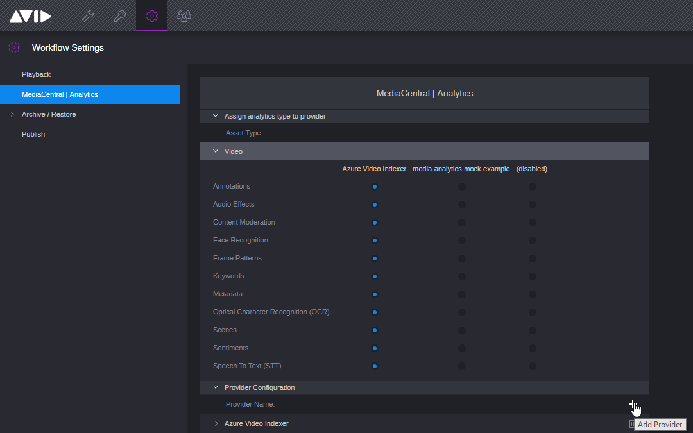
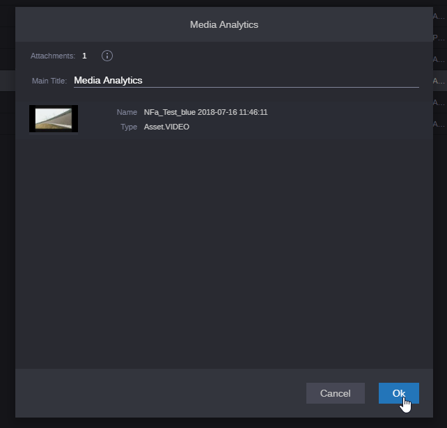

# Media-analytics-mock-example
You can check the [docs](http://developer.avid.com/mediaAnalytics/api/media_analytics_api.html) on how to create Media analytics service. 

Remember you need to install [proxy-bal](https://my.avid.com/cpp/sdk/apc) (check in package.json)!

Go to project.config.json and set up hostIp under connection to CloudUX.

Remember to set appID and appSecret in package.json. If you dont know how to obtain them see the [development guide.](http://developer.avid.com/connector_api/cloudux-starter-kit-service/development_guide/index.html#distribution)

**Configuration**

1. Login to admin panel of your Mediacentral. 

2. Under MediaCentral | Analytics add new provider. 

3. Set correct options. 
 - Provider name needs to match name of BUS service.
 - Realm needs to match id of system. For example MAM id.

4. Check your media analytics service and save.

5. Check your media analytics service and save.

6. Go to selected media and under action trigger the job.

7. Trigger the job.

8. Your break-point should be hit.

9. Status of media-analytics job should be visible in process app.

10. Result of media-analytics job should be visible in it's metadata under OCR.

